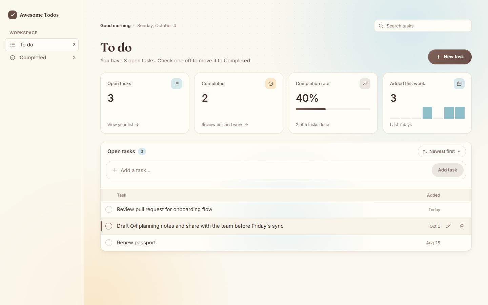
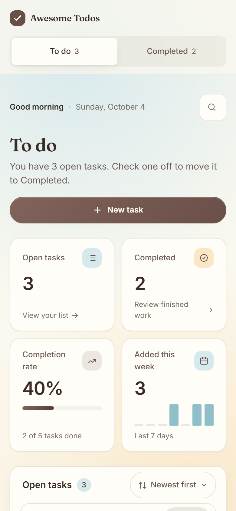

# Awesome Todos

A calm, focused task manager built with React and Express. Add, complete, edit and organise your tasks in a clean interface that works just as well on a wide desktop monitor as it does on a phone.

**Live demo:** [awesometodos-app-1.onrender.com](https://awesometodos-app-1.onrender.com/)



## Features

- **Fast task capture** – add a task from anywhere with the *New task* button. You get clear validation and confirmation as you go.
- **Inline editing** – rename a task in place with the edit button or a double-click. `Enter` saves and `Esc` cancels.
- **To do and Completed** – checking a task off moves it from *To do* to *Completed*, with a short animation and an *Undo* option. Unchecking it sends it back.
- **Search** – filter either view instantly by keyword (`/`). The current view lives in the URL, so refreshes and the back button behave as expected.
- **Mint chocolate theme** – a warm palette of chocolate, mint, sage and cream, with serif headings, an animated ambient background and light and dark modes.
- **Forgiving deletes** – deleted tasks can be restored with *Undo* for five seconds. Clearing all completed tasks asks for confirmation first.
- **Dashboard summary** – cards for open tasks, completed tasks, completion rate and a 7-day chart of tasks added. Cards link to their views and the chart shows details on hover.
- **Sorting** – order the list by newest, oldest or A to Z. Your choice is remembered on this device.
- **Thoughtful feedback** – optimistic updates with automatic rollback when a request fails, plus loading skeletons and empty, no-results and error states.
- **Responsive by design** – a sidebar layout on desktop, a compact top bar on tablet and a segmented control on mobile, with touch-sized targets throughout.
- **Accessible** – semantic HTML, full keyboard support, visible focus states, labelled controls and screen-reader announcements. Light and dark themes follow the system setting, and motion is reduced when the user prefers it.

<p align="center">
  
</p>

## Keyboard shortcuts

| Shortcut | Action |
| --- | --- |
| `N` | Focus the new-task field |
| `/` | Focus search |
| `↑` / `↓` | Move between tasks in the list |
| `E` | Edit the focused task |
| `Delete` | Delete the focused task (with undo) |
| `Enter` | Add a task or save an edit |
| `Esc` | Cancel an edit or clear the search |

## Tech stack

| Layer | Technology |
| --- | --- |
| Front end | React 19, Vite 7, plain CSS with design tokens (no UI framework) |
| Back end | Node.js, Express 5 |
| Database | MongoDB (official Node.js driver) |
| Hosting | Render (Express serves the built front end and the API) |

## Project structure

```
.
├── client/react-app/          # React front end (Vite)
│   ├── index.html
│   ├── public/                # Static assets (favicon)
│   └── src/
│       ├── App.jsx            # Page layout and top-level state
│       ├── api.js             # REST client for /api/todos
│       ├── components/        # UI components (task list, composer, sidebar, overview…)
│       ├── hooks/             # useTodos, useToasts, useHashView, useKeyboardShortcuts
│       ├── lib/tasks.js       # Views, validation and date helpers
│       └── styles.css         # Design tokens and component styles
├── server/                    # Express API
│   ├── index.js               # App entry point, serves build/ and /api
│   ├── routes.js              # Todo REST endpoints
│   ├── models/index.js        # MongoDB connection
│   └── build/                 # Production build of the client (committed)
└── docs/                      # README screenshots
```

## Getting started

### Prerequisites

- [Node.js](https://nodejs.org/) 20.19 or later (required by Vite 7 and the MongoDB driver)
- A MongoDB database, either local or hosted on [MongoDB Atlas](https://www.mongodb.com/atlas)

### 1. Clone the repository

```bash
git clone https://github.com/anniesrdnl/Awesometodos_app.git
cd Awesometodos_app
```

### 2. Configure the server

Create `server/.env`:

```env
MONGODB_URI=mongodb+srv://<user>:<password>@<cluster>/<options>
PORT=5000
```

| Variable | Required | Description |
| --- | --- | --- |
| `MONGODB_URI` | Yes | MongoDB connection string. Tasks are stored in the `todos` collection of the `myDatabase` database. |
| `PORT` | No | Port for the Express server. Defaults to `5000`. |

### 3. Install dependencies

```bash
cd server && npm install
cd ../client/react-app && npm install
```

### 4. Run in development

Start the API and the front end in two terminals:

```bash
# Terminal 1 – API on http://localhost:5000
cd server
npm run dev
```

```bash
# Terminal 2 – front end on http://localhost:5173
cd client/react-app
npm run dev
```

Open http://localhost:5173. The Vite dev server proxies `/api` requests to the Express server on port 5000.

## Building for production

Express serves the compiled front end from `server/build`. After making changes to the client, rebuild it and copy the output into that folder.

**macOS / Linux**

```bash
cd client/react-app
npm run build
rm -rf ../../server/build && cp -r dist ../../server/build
```

**Windows (PowerShell)**

```powershell
cd client/react-app
npm run build
Remove-Item -Recurse -Force ..\..\server\build
Copy-Item -Recurse dist ..\..\server\build
```

Then start the production server:

```bash
cd server
npm start
```

The app is now available at http://localhost:5000.

## Deployment

The live demo runs on [Render](https://render.com/) as a single Node web service. A typical configuration:

| Setting | Value |
| --- | --- |
| Root directory | `server` |
| Build command | `npm install` |
| Start command | `npm start` |
| Environment variables | `MONGODB_URI` |

Because the service serves the committed `server/build` folder, rebuild the client and commit the updated build before pushing.

## API reference

All endpoints are prefixed with `/api` and exchange JSON.

| Method | Endpoint | Body | Description |
| --- | --- | --- | --- |
| `GET` | `/todos` | – | List all tasks |
| `POST` | `/todos` | `{ "todo": "Buy milk" }` | Create a task. Returns `201` with the new task. |
| `PUT` | `/todos/:id` | `{ "status": false }` or `{ "todo": "New title" }` | Toggle completion or rename a task |
| `DELETE` | `/todos/:id` | – | Delete a task |

A task looks like this:

```json
{ "_id": "66f9c2a1e4b0a1b2c3d4e5f6", "todo": "Buy milk", "status": false }
```

> **Note:** `status` in a `PUT` request is the task's **current** status. The server stores the opposite value, so sending `{ "status": false }` marks the task as completed. Titles are trimmed and must not be empty.

## Available scripts

| Location | Command | Description |
| --- | --- | --- |
| `server/` | `npm run dev` | Start the API with automatic restarts (nodemon) |
| `server/` | `npm start` | Start the API in production mode |
| `client/react-app/` | `npm run dev` | Start the Vite dev server |
| `client/react-app/` | `npm run build` | Build the front end into `dist/` |
| `client/react-app/` | `npm run preview` | Preview the production build locally |
| `client/react-app/` | `npm run lint` | Lint the front end with ESLint |

## Author

Built by [anniesrdnl](https://github.com/anniesrdnl).
